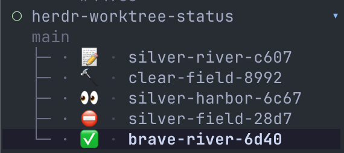

# Worktree Status for Herdr

A [Herdr](https://herdr.dev) plugin that assigns a workflow status to a
worktree workspace and shows it as an emoji right before the workspace name in
the sidebar.



The leading circle is Herdr's own `state_icon`; the emoji is the status set by
this plugin. Statuses are stored by the plugin and restored automatically after
a Herdr restart or when you reopen the same worktree.

## Requirements

- Herdr `0.7.5` or newer
- macOS or Linux
- Bash 3.2 or newer (the stock `/bin/bash` on macOS is enough)

No other runtime is needed: no `jq`, `fzf`, Node.js, or Python.

## Installation

```bash
herdr plugin install shved270189/herdr-worktree-status
```

Herdr shows the manifest and the commands it will run before confirming.

### Local development

```bash
git clone https://github.com/shved270189/herdr-worktree-status.git
herdr plugin link /path/to/herdr-worktree-status
bash tests/run.sh
```

`herdr plugin unlink shved270189.worktree-status` removes the link again.

## Sidebar configuration (required)

The plugin publishes the status as the custom workspace token
`worktree_status`. Herdr only renders custom tokens that appear in your sidebar
layout, so add `$worktree_status` to the Space rows in
`~/.config/herdr/config.toml`:

```toml
[ui.sidebar.spaces]
rows = [
  ["state_icon", "$worktree_status", "workspace"],
  ["branch", "git_status"],
]
```

Then reload the config (`herdr server reload-config`, or `reload config` in the
Herdr menu). The plugin never edits `config.toml` for you.

## Usage

The plugin registers one action, `Set worktree status…`
(`shved270189.worktree-status.set-status`). It applies to the workspace it was
invoked from and opens a small popup:

```
Set worktree status

 > 📝  Planning
   🔨  In progress
   👀  Review
   ⛔  Blocked
   ✅  Done
       Clear
```

- `↑` / `↓` or `k` / `j` move
- `Enter` applies the highlighted status and closes the popup
- `Esc` or `q` cancels without changing anything

Invoke it from a keybinding (recommended) or from the CLI. The CLI form targets
the currently focused workspace:

```bash
herdr plugin action invoke shved270189.worktree-status.set-status
```

### Optional keybinding

The plugin does not add keybindings. Pick a free key yourself; `cmd+s` is
only an example and may already be taken in your setup:

```toml
[[keys.command]]
key = "cmd+s"
type = "plugin_action"
command = "shved270189.worktree-status.set-status"
description = "set worktree status"
```

## Statuses

| Status      | Emoji | Stored id     |
| ----------- | ----- | ------------- |
| Planning    | 📝    | `planning`    |
| In progress | 🔨    | `in_progress` |
| Review      | 👀    | `review`      |
| Blocked     | ⛔    | `blocked`     |
| Done        | ✅    | `done`        |
| Clear       |       | (removed)     |

Only the emoji reaches the sidebar; the id is what the plugin persists.

## Persistence

Herdr workspace metadata is display-only state and does not survive a cold
server restart, so the plugin keeps its own record in
`$HERDR_PLUGIN_STATE_DIR/statuses.tsv` (one `status<TAB>key` line per
workspace; `herdr plugin config-dir shved270189.worktree-status` prints the sibling
config directory).

- A worktree workspace is identified by its checkout path, so the status
  survives Herdr restarts and closing/reopening the same worktree.
- A workspace without Git worktree provenance is identified by its workspace
  id, which survives a server restart but not closing and reopening it.
- Statuses are re-applied by a `[[startup]]` hook after Herdr restores its
  session and by a `workspace.created` event hook when a workspace is opened.
- Choosing `Clear` removes both the sidebar token and the persisted entry.
- Entries whose worktree directory no longer exists are dropped during restore.

## Uninstall

```bash
herdr plugin uninstall shved270189.worktree-status
```

This removes the managed checkout. Plugin state stays in
`~/.local/state/herdr/plugins/shved270189.worktree-status` (or the state directory
Herdr reports) and can be deleted by hand. Remove `$worktree_status` from your
sidebar rows if you no longer want the column.

## Limitations

- **No native right-click entry.** Herdr 0.9 builds the workspace context menu
  from a fixed list (Rename, Close, New worktree, Open worktree, Delete
  worktree checkout) and plugin v1 offers no way to extend it. The action must
  be invoked through a keybinding or the CLI.
- The popup shows the status of the workspace that was focused when the action
  ran; it does not follow focus changes while open.

## Publishing to the Herdr marketplace

The marketplace indexes public GitHub repositories automatically. Add the
GitHub topic `herdr-plugin` to the repository and keep `herdr-plugin.toml` on
the default branch; the index refreshes about every 30 minutes.

## License

MIT
